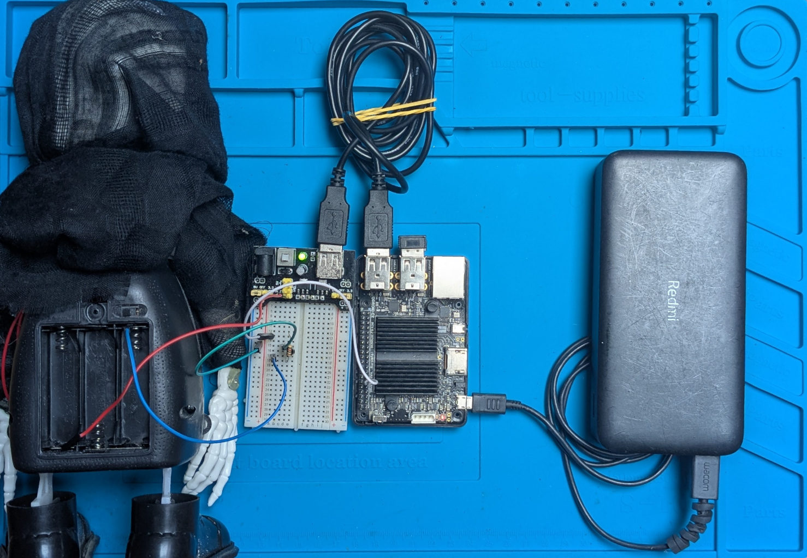
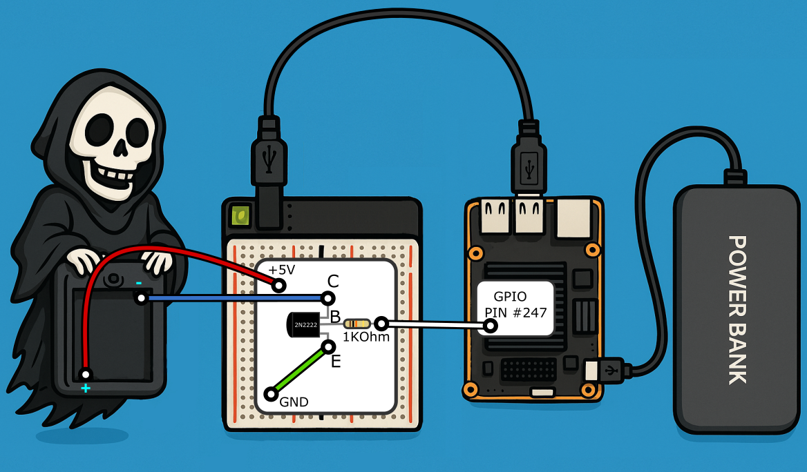

# BLACK FAT CAT PROJECT

## The problem


I have a dog door and 2 pets - a dog Daisy and a cat Czarnuszka. There is the third pet - a black fat cat, which is not mine. It is a stranger cat which comes to my home at night and scares my cat and wakes us up. I want to prevent this cat from entering my house while allowing my pets to enter and exit freely.

Requirements:
- Do not harm the black fat cat, just scare it away.
- Do not harm my pets.
- Use stuff I already have at home.

## The project


Found a few stuff that may help me with the project:
- Old System On Module (SOM) board Odroid C2 with Ubuntu 20.04
- USB endoscope camera - would prefer a regular camera, as this one has very narrow field of view, but it is what I have
- Breadboard and some wires
- 2222 transistors
- 5V/3.3V power module for convenience
- Old toy - witch that screams and moves when switched on

## Phase 1 - control the witch

I prepared a simple circuit to control the witch. I used a 2222 transistor to switch the witch on and off using a GPIO pin from the Odroid C2. The witch is powered by 3 AA batteries (~4.5V), so I used a 5V power module to make it work. The witch draws ~0.2A so it is within the limits of the transistor and USB power supply connected to Odroid C2. I used a 1k resistor to limit the current to the base of the transistor:

```
                    +5V
                     |
                     ▼
                  [WITCH]
                     |
                     ▼
                     C
ODROID C2           /
3.3V GPIO─[1kΩ]───B| 2N2222
                    \
                     E
                     |
                     ▼
                    GND
```

The photo of the circuit:


And the schematic:


I tested it using a bash script that turns the GPIO pin on and off. I used GPIO #247 based on the [Odroid C2 GPIO pinout](doc/3-c2-pins.png).

The [script](tools/trigger-witch.sh) is very simple:
```bash
#!/bin/bash

GPIO=247

echo "$GPIO" > /sys/class/gpio/export
echo "out" > /sys/class/gpio/gpio$GPIO/direction

echo "Turn on witch"
echo "1" > /sys/class/gpio/gpio$GPIO/value  # Turn ON
sleep 1
echo "Make witch sleep"
echo "0" > /sys/class/gpio/gpio$GPIO/value  # Turn OFF

# Cleanup
echo "$GPIO" > /sys/class/gpio/unexport
```

After running the script, the witch starts screaming and moving for a second, then stops.

Everything works as expected. I can control the witch using the GPIO pin from the Odroid C2. The next step is to add a camera and check if I can detect a cat using it.

## Phase 2 - detect a cat (any)

Planned YOLO v8 based project to detect a cat using the camera.
Implementation is in tools/cat-detector

### Problem #1 - development on an old hardware with an old OS

Developing things on old stuff is not easy. Up-to-date libs are not necessarily tested with such a setup or explicitly not supported. After created a basic project on my laptop, I tried to run it on the Odroid C2 and it failed ON THE FIRST line of the python script:
```python
import cv2
```
The error was:
```
Illegal instruction (core dumped)
```
After running it under gdb, I found out that the problem is with the `numpy` library:

```
Thread 2 "python3" received signal SIGILL, Illegal instruction.
[Switching to Thread 0x7fb5dbc1e0 (LWP 10940)]
0x0000007fb61c1564 in blas_thread_server ()
   from .../.venv/lib/python3.8/site-packages/numpy/core/../../numpy.libs/libopenblas64_p-r0-cecebdce.3.21.so
```

 Time to start debugging.