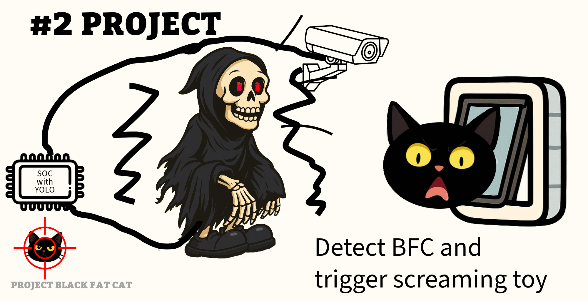

# BLACK FAT CAT PROJECT

## The problem

I have a dog door and 2 pets - a dog Daisy and a cat Czarnuszka. There is the third pet - a black fat cat, which is not mine. It is a stranger cat which comes to my home at night and scares my cat and wakes us up. I want to prevent this cat from entering my house while allowing my pets to enter and exit freely.

Requirements:
- Do not harm the black fat cat, just scare it away.
- Do not harm my pets.
- Use stuff I already have at home.

## The project

Found a few stuff that may help me with the project:
- Old System On Module (SOM) board Odroid C2 with Ubuntu 20.04
- USB endoscope camera - would prefer a regular camera, as this one has very narrow field of view, but it is what I have
- Breadboard and some wires
- 2222 transistors
- 5V/3.3V power module for convenience
- Old toy - witch that screams and moves when switched on

## Phase 1 - control the witch

TODO